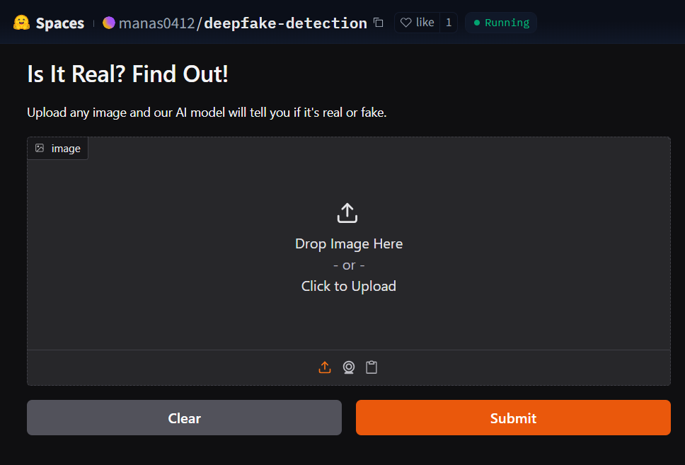

# **Deepfake Detection**

A Deep Learning model designed to classify images as Real or AI-generated (Fake). Built with TensorFlow, evaluated using the CIFAKE dataset and deployed via a Gradio app for interactive use.

## 📚 Project Overview

This project tackles the challenge of distinguishing between AI-generated (Fake) images and Real images. In response to the growing sophistication of generative models (e.g. **Adobe Firefly**, **Stable Diffusion**, **Midjourney**), we build a binary classification model that leverages a pre-trained **EfficientNetB2** network to effectively classify images as **Real** or **Fake**. Our approach emphasizes robust performance even under adversarial perturbations.

## 🔗 Live Demo

[](https://huggingface.co/spaces/manas0412/deepfake-detection)

### 🖼️ Screenshot



## 🧰 Tech Stack

- **Core Frameworks:** Python 3.11.11, TensorFlow 2.18, Keras
- **Adversarial Robustness:** ART (Adversarial Robustness Toolbox)
- **Data Handling & Visualization:** NumPy, scikit-learn, Matplotlib, Seaborn
- **Demo Interface:** Gradio (deployed on HuggingFace Spaces)

## 🗃️ Dataset

- **Source:** [CIFAKE (Kaggle)](https://www.kaggle.com/datasets/birdy654/cifake-real-and-ai-generated-synthetic-images)
- **Train:** 50,000 Real, 50,000 Fake (32×32)
- **Test:** 10,000 Real, 10,000 Fake (32×32)

## 🧠 Model Architecture

The model is built on **EfficientNetB2** with **ImageNet** pre-trained weights (frozen initially). The architecture is as follows:

1. **Base Model**: EfficientNetB2 (without the top classification layers).
2. **GlobalAveragePooling2D**: Reduces spatial dimensions.
3. **Dropout (0.4)**: Regularization technique to prevent overfitting.
4. **Dense Output Layer**: Single neuron with a sigmoid activation to produce a binary classification (**Real** or **Fake**).

## 🚀 Training Strategy

1. **Initial Training Phase (20 epochs)**

   - Freeze EfficientNetB2 base weights.
   - Optimizer: Adam (learning rate = 1e-3).
   - Label smoothing applied (0.1) to improve generalization.

2. **Adversarial Attack and Training (5 epochs)**

   - Generate **Adversarial Examples** using **FGSM** attack (ε = 0.05) on 30% of the training set.
   - Train on a mixture of clean and adversarial examples to enhance robustness.

3. **Fine-Tuning Phase (10 epochs)**

   - Unfreeze the entire EfficientNetB2 backbone.
   - Optimizer: Adam (learning rate = 1e-5) for gentle weight updates.

4. **Threshold Optimization**

   - Find the best classification threshold by analyzing the Precision-Recall (PR) curve on the validation set.

5. **Training Callbacks:**
   - `EarlyStopping` Stops training early if Validation Loss does not improve, to prevent overfitting and save compute time.
   - `ReduceLROnPlateau` Reduces Learning Rate when the validation loss plateaus for smoother convergence.

## 🧪 Evaluation

The model is evaluated across three scenarios:

- **Standard Test**: Evaluation on the original, clean (unaltered) test dataset.
- **Adversarial Robustness Test**: Evaluation on adversarial examples generated via **FGSM** (ε = 0.05) for 30% of the test samples.
- **Mixed Robustness Test**: Evaluation on a combined set of clean and adversarial images.

### Metrics Used:

- Accuracy
- Precision
- Recall
- F1-Score
- ROC-AUC Score
- Confusion Matrix (with visualization)

## 📊 Test Results

| Test Data                           | Accuracy | Precision | Recall | F1 Score | Misclassifications | AUC    |
| ----------------------------------- | -------- | --------- | ------ | -------- | ------------------ | ------ |
| **Original Images**                 | 94.72%   | 94.12%    | 95.40% | 94.76%   | 1056/20000 (5.28%) | 0.9872 |
| **FGSM Adversarial Images**         | 94.65%   | 94.06%    | 95.40% | 94.73%   | 321/6000 (5.35%)   | 0.9870 |
| **(Original + Adversarial) Images** | 94.70%   | 94.11%    | 95.40% | 94.75%   | 1377/26000 (5.30%) | 0.9871 |

### Key Insights:

- **Standard Test:** Excellent performance with high accuracy, precision, recall, and F1 score. Low misclassification rate. ✅
- **Adversarial Robustness Test:** Minimal performance drop under adversarial conditions, maintaining robustness. 🔥
- **Mixed Robustness Test:** Consistent performance on both clean and adversarial datasets, demonstrating strong generalization. 💪

## ⚡ Usage Instructions

1. **Clone the repository**

   ```bash
   git clone https://github.com/manask0412/deepfake-detection.git
   cd deepfake-detection
   ```

2. **Create & activate a virtual environment (optional but recommended)**

   ```bash
   # macOS/Linux
   python -m venv venv
   source venv/bin/activate

   # Windows
   python -m venv venv
   .\venv\Scripts\activate
   ```

3. **Install dependencies**
   ```bash
   pip install -r requirements.txt
   ```
4. **Train the Model**
   ```bash
   python train.py
   ```
5. **Evaluate the Model**
   ```bash
   python evaluate.py
   ```
   **Note:**
   - The `train.py` script handles the model training and saving.
   - The `evaluate.py` script loads the saved model and performs evaluation on clean, adversarial and combined datasets.

### 💾 Model Saving

After training and evaluation, the final model is saved for deployment and reuse. The model is saved in path `models/final_model.h5`

## 📈 Future Improvements

- Training with larger, high-resolution datasets (e.g., 128×128 or 256×256 images).
- Explore ensemble methods for even stronger adversarial robustness.
- Benchmark performance against newer synthetic image generators (e.g., DALL·E 3, Sora).

## 🤝 Acknowledgements

- **CIFAKE Dataset**
  - Krizhevsky, A., & Hinton, G. (2009). Learning multiple layers of features from tiny images.
  - Bird, J.J. and Lotfi, A., 2024. CIFAKE: Image Classification and Explainable Identification of AI-Generated Synthetic Images. IEEE Access.
  - Real images are from Krizhevsky & Hinton (2009), fake images are from Bird & Lotfi (2024). The Bird & Lotfi study is available [here](https://ieeexplore.ieee.org/abstract/document/10409290)
- **TensorFlow** and **Keras** for powerful deep learning tools.
- **Hugging Face** and **Gradio** for enabling real-time and interactive model deployment.

## Contributors

| Name             | Linkedin Profile                                               | Role      |
| ---------------- | -------------------------------------------------------------- | --------- |
| Manas Kumar Jena | [manaskumarjena](https://www.linkedin.com/in/manas-kumar-jena) | Developer |
